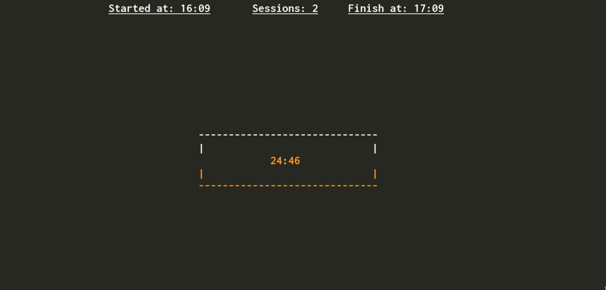

### Screenshot


A simple pomodoro timer written in bash

###Usage:

Default parameters: __25__ min session For __1__ round (__5__ min Break)

```sh
pomo
```
Specifiy the parameters:

```sh
pomo 25 4
#Or 
pomo 50 2 
```
> Supports notifications using `notify-send`
